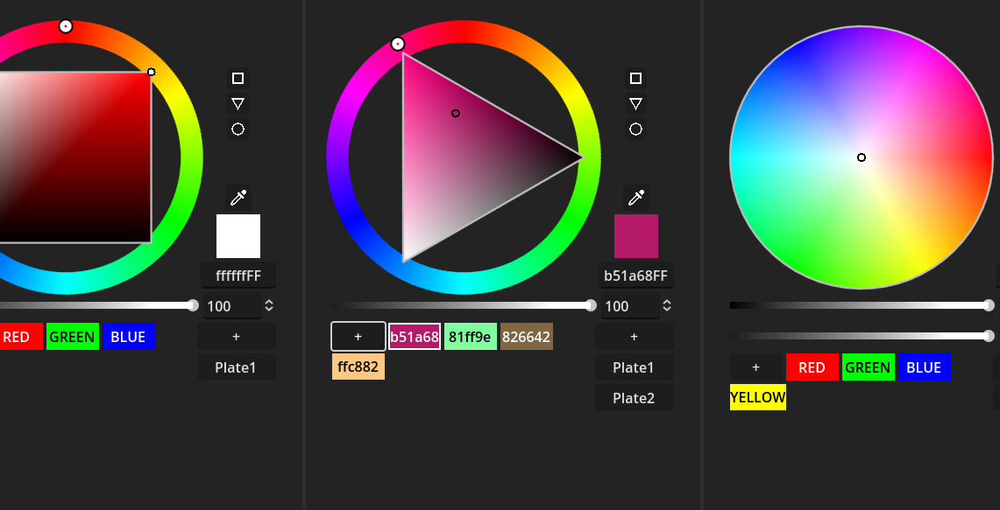

# Custom Color Picker

A feature-rich color picker built for Godot 4.3, designed to enhance color selection workflows in game and app development. This tool offers multiple shape modes (square, triangle, circle), an eyedropper, color plates for saving presets, and full RGBA support via hex input.

It’s mostly ready to use, though it’s not fully tested and might need a little effort to integrate into your projects.


[Showcase Video](https://youtu.be/c6Adz4VlqQE?feature=shared)
## Features

- **Multiple Shape Modes**:
  - **Square**: Fixed HSV square for intuitive saturation and value control.
  - **Triangle**: Rotating HSV triangle for a compact color selection experience.
  - **Circle**: Circular hue wheel with adjustable darkness slider.
- **Interactive Controls**:
  - Drag the hue ring (left-click) to adjust the base color.
  - Drag the shape handle (left-click) to fine-tune saturation and value.
  - Adjust the picker size (right-click and drag on the ring).
  - Cycle shape modes (middle-click).
- **Eyedropper Tool**: Pick colors from anywhere on the screen with a magnifier window.
- **Color Plates**: Save up to 10 colors per plate, with multiple plates for organization. New colors appear first in the list.
- **Alpha Support**: Adjust transparency via a slider or RGBA hex input.
- **Hex Input**: Enter 6-digit RGB or 8-digit RGBA hex codes to set colors directly.
- **Dynamic UI**: Resizes with the window, with a checkerboard background for transparency visualization.

## Installation

1. **Clone the Repository**:
2. **Add to Your Godot Project**:
   - Copy the `ColoPicker` folder into your Godot project's `res://` directory.
   - Ensure all dependencies (e.g., icons in `res://_icons/`) are included.
3. **Scene Setup**:
   - Open Godot and add the `ColorPickerControl.tscn` scene (or create your own scene using the provided `.tscn` file) to your project.
   - Attach the `ColorPickerControl.gd` script to a `Control` node if building from scratch.

### Dependencies
- Godot 4.3 or later.

## Usage

1. **Add to Scene**:
   - Instance the `ColorPickerControl.tscn` in your scene tree or attach the `ColorPickerControl.gd` script to a `Control` node with the appropriate node hierarchy (see the `.tscn` file for structure).
2. **Interact with the Picker**:
   - **Shape Selection**: Click the square, triangle, or circle buttons to switch modes.
   - **Color Adjustment**: Use the hue ring and shape handle to select a color.
   - **Eyedropper**: Click the eyedropper button to pick a screen color.
   - **Alpha**: Adjust the alpha slider or enter an RGBA hex code.
   - **Save Colors**: Click the "+" button in the color plates section to save the current color (appears first in the list).
   - **New Plate**: Click the "+" button in the tab headers to create a new plate (stays at the top).
3. **Hex Input**:
   - Enter a 6-digit hex code (e.g., `FF0000` for red) or an 8-digit RGBA code (e.g., `FF00007F` for semi-transparent red) in the hex field.

### Example Scene Tree
```plaintext
[PanelContainer]
├── VBoxContainer
    ├── HBoxContainer
    │   ├── ColorPickerControl (Control with script)
    │   └── VBoxContainer
    │       ├── Shapes (SquareButton, TriangleButton, CircleButton)
    │       ├── EyeDropper (Button)
    │       ├── CheckTexture (TextureRect with CurrentAlphaColor)
    │       └── HEXColorCode (LineEdit)
    ├── Darkness (HSlider + SpinBox)
    ├── Alpha (HSlider + SpinBox)
    └── ColorPlatesTabs
        ├── TabContent (HFlowContainer with NewColorButton)
        └── ScrollContainer
            └── TabHeaders (VBoxContainer with NewPlateTab)
```

## Code Structure

- **`ColorPickerControl.gd`**: Main script handling UI, input, and color management.
- **`ColorManager.gd`**: Manages color calculations and shape mode transitions.
- **`InputHandler.gd`**: Processes mouse input for dragging and interaction.
- **`ShapeDrawer.gd`**: Handles custom drawing of the color picker shapes.

## Customization

- **Exported Variables**:
  - `radius_factor`: Initial size of the picker (0.0–1.0).
  - `line_width`: Thickness of the hue ring.
  - `initial_value`: Starting hue (0–360).
  - `min_radius_factor` / `max_radius_factor`: Limits for resizing.
- **Styling**: Modify the `StyleBoxFlat` properties in `update_color_buttons()` for custom button appearances.
- **Color Names**: Edit the `COLOR_NAMES` dictionary to add or change named colors.

## Contributing

Contributions are welcome! To contribute:

1. Fork the repository.
2. Create a feature branch (`git checkout -b feature/your-feature`).
3. Commit your changes (`git commit -m "Add your feature"`).
4. Push to the branch (`git push origin feature/your-feature`).
5. Open a pull request.

Please ensure your code follows Godot’s GDScript style guidelines and includes comments for clarity.

### Bug Tracking

If you encounter any issues, please help us improve by reporting them:

1. **Check Existing Issues**: Search the [Issues](https://github.com/Unique-Digital-Resources/my-cusom-ui-controls-for-godot/issues) tab to see if the bug has already been reported.
2. **File a New Issue**:
   - Go to the [Issues](https://github.com/Unique-Digital-Resources/my-cusom-ui-controls-for-godot/issues) tab.
   - Click "New Issue" and select "Bug Report" (if available, or use the default template).
   - Provide a clear title (e.g., "Hex Input Fails with Lowercase Values").
   - Include:
     - **Description**: What happened and what you expected.
     - **Steps to Reproduce**: Detailed steps to trigger the bug.
     - **Environment**: Godot version, OS, and any relevant setup details.
     - **Screenshots/Logs**: Attach visuals or error messages if applicable.
3. **Labeling**: Add the "bug" label to help us prioritize it.

We’ll review and address reported bugs as soon as possible. Contributions to fix bugs are also appreciated!

## License

This project part is licensed under the MIT License.

## Credits

- **Author**: Abdo Mahmoud
- **Built with**: Godot 4.3

## Patreon
[Support me on Patreon](https://patreon.com/user?u=101292544)
